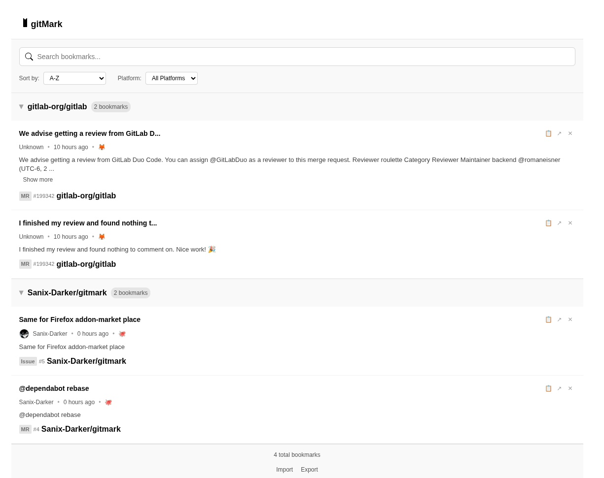

# GitMark - Universal Git Bookmark Extension


A web extension for bookmarking MR|PR's/issues's comments/code across Git platforms with repository-centric organization.

## Browser Support

| Browser       | Status          |
|---------------|-----------------|
| Chrome/Edge   | ✅ Supported    |
| Firefox       | 🚧 In Progress  |
| Safari        | ❌ Planned      |

## Supported Platforms

| Platform          | Cloud                  |
|-------------------|------------------------|
| GitLab            | ✅ gitlab.com          |
| GitHub            | ✅ github.com          |
| Gitea             | ✅ codeberg.org        |
| Bitbucket         | ✅ bitbucket.org       |
| SourceHut         | ✅ sr.ht               |
| Azure DevOps      | ✅ dev.azure.com       |
| CodeGiant         | ✅ codegiant.io        |
| GitKraken         | ✅ gitkraken.com       |

## Core Features

| Feature                          | Description                                          |
|----------------------------------|------------------------------------------------------|
| One-Click Bookmarking            | Save comments/code with single click                 |
| Auto-Title Suggestion            | Titles from comment text or parent context           |
| Repository Organization          | Grouped by `namespace/project` hierarchy            |
| Expandable Sections              | Collapse/expand repos and discussion threads         |
| Instant Search                   | Find bookmarks with highlighted results              |
| Cross-Platform Export            | Download all bookmarks as JSON                       |

## Installation

1. Clone repo: `git clone https://github.com/your-repo/gitmark`
2. Install dependencies: `npm install`
3. Build extension: `npm run build`
4. Load in Chrome:
   - Go to `chrome://extensions`
   - Enable **Developer mode**
   - Click **Load unpacked** → Select `/dist` folder

## Usage

1. Navigate to supported Git platform (GitHub PR, GitLab MR, etc.)
2. Click **📑 icon** on any comment
3. Access bookmarks via extension popup:
   ```plaintext
   repo-name/
   ├── MR #123 (3 bookmarks)
   ├── Issue #456 (2 bookmarks)
   └── Snippets (1 bookmark)
   ```
4. Export data via **Export** button

## Technical Overview

### URL Pattern Support
```regex
GitLab: /group/project/-/merge_requests/123#note_456
GitHub: /user/repo/issues/123#issuecomment-456
```

### Storage Schema
```json
{
  "namespace/repo": [
    {
      "id": "unique-id",
      "title": "Suggested title",
      "permalink": "https://...",
      "platform": "gitlab",
      "type": "merge_request",
      "commentText": "Saved content...",
      "author": "username",
      "timestamp": "ISO-8601"
    }
  ]
}
```

## Build Commands
```bash
# Browser-specific builds
npm run build:chrome    # Chrome/Edge
npm run build:firefox   # Firefox
npm run build:safari    # Safari
```

## Privacy
- Zero external servers
- All data stored locally in your browser
- Open-source code with no tracking

## AUTHOR

- [Sanix-Darker](https://github.com/sanix-darker)
